# SOLUTION — Lab M5.07: Configuration Management with Ansible

## Overview

This lab implements configuration management with **Ansible** using a local inventory, reusable variables, Jinja2 templates, multiple playbooks, an Ansible role, and a GitHub Actions CI workflow.

The completed solution demonstrates:

- Ansible installed inside a Python virtual environment
- Localhost inventory configuration
- Shared variables in `group_vars`
- Base server configuration with packages and directories
- Environment-specific Jinja2 templating
- nginx web server configuration
- A reusable `webserver` Ansible role
- `ansible-lint` and syntax validation
- Check-mode / dry-run execution
- Automated GitHub Actions validation on push

---

## Step 1 — Create the Project Structure

The required Ansible project structure was created with:

```bash
mkdir -p group_vars templates roles/webserver/{tasks,templates,defaults,handlers}

touch ansible.cfg inventory.ini site.yml webserver.yml role-webserver.yml
touch group_vars/all.yml templates/app.conf.j2
touch roles/webserver/tasks/main.yml
touch roles/webserver/templates/index.html.j2
touch roles/webserver/defaults/main.yml
touch roles/webserver/handlers/main.yml
```

The structure was verified using:

```bash
find . -type f | sort
```

The project contains the expected Ansible configuration, inventory, playbooks, templates, variables, and role files.

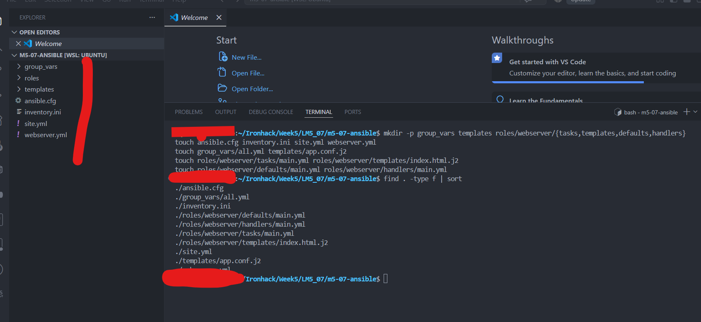

---

## Step 2 — Install Ansible

A Python virtual environment was created and activated:

```bash
python3 -m venv .venv
source .venv/bin/activate
```

Ansible and `ansible-lint` were installed inside the virtual environment.

To avoid accidentally using an older system `pip`, the Python interpreter from the virtual environment can be used directly:

```bash
python -m pip install --upgrade pip setuptools wheel
python -m pip install ansible ansible-lint
```

The installation was verified with:

```bash
ansible --version
ansible-lint --version
```

The output confirmed that Ansible was running from `.venv` with Python 3.

A `.gitignore` file was also added so the local virtual environment and temporary files are not committed:

```gitignore
.venv/
__pycache__/
*.retry
```

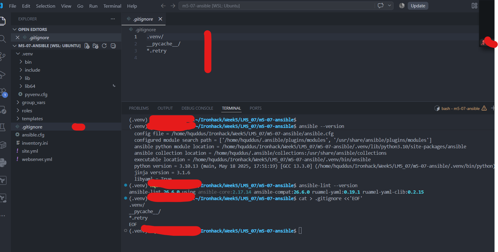

---

## Step 3 — Configure Ansible Defaults

The following `ansible.cfg` was created:

```ini
[defaults]
inventory = inventory.ini
host_key_checking = False
retry_files_enabled = False
stdout_callback = default
result_format = yaml
```

This makes `inventory.ini` the default inventory, disables SSH host-key prompts for the lab environment, disables retry files, and uses readable output formatting.

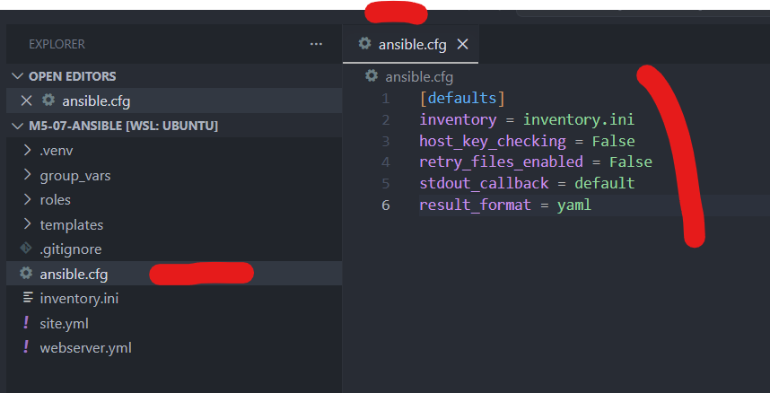

---

## Step 4 — Create the Inventory

The `inventory.ini` file defines two groups that both target localhost:

```ini
[local]
localhost ansible_connection=local ansible_python_interpreter=/usr/bin/python3

[webservers]
localhost ansible_connection=local ansible_python_interpreter=/usr/bin/python3
```

Connectivity was tested with:

```bash
ansible all -m ping
```

Successful result:

```text
localhost | SUCCESS => {
    "changed": false,
    "ping": "pong"
}
```

This confirmed that Ansible could successfully target the configured host.

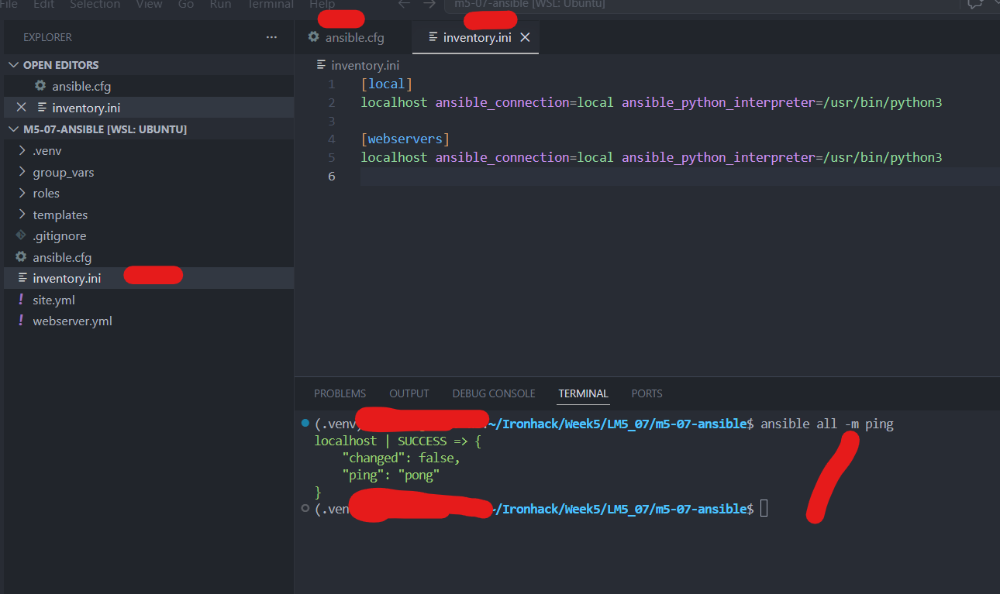

---

## Step 5 — Define Shared Variables

Global variables were added in `group_vars/all.yml`:

```yaml
---
app_name: "bootcamp-app"
app_environment: "development"
app_port: 8080
deploy_user: "{{ lookup('env', 'USER') | default('root', true) }}"

packages:
  - nginx
  - git
  - curl

app_directories:
  - /opt/{{ app_name }}
  - /opt/{{ app_name }}/config
  - /opt/{{ app_name }}/logs
  - /var/www/{{ app_name }}

nginx_worker_processes: 2
nginx_server_name: "localhost"
```

These variables are automatically available to the playbooks and templates.

The environment lookup for `deploy_user` ensures Ansible uses a real local user instead of a hard-coded account.

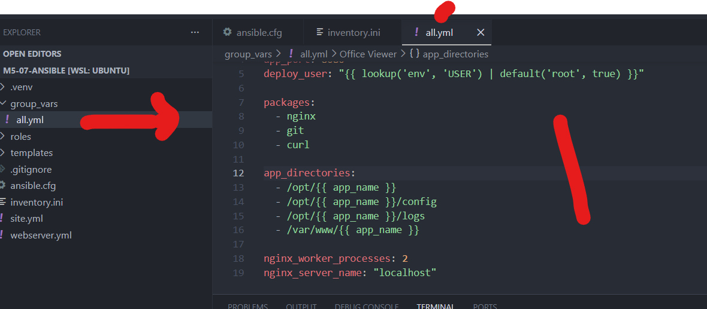

---

## Step 6 — Write the Base Configuration Playbook

The `site.yml` playbook configures the base server.

It performs the following tasks:

1. Updates the apt package cache on Debian-based systems.
2. Installs `nginx`, `git`, and `curl`.
3. Creates application directories.
4. Deploys the application configuration from a Jinja2 template.
5. Displays a summary of the configuration.

Key structure:

```yaml
---
- name: Base server configuration
  hosts: local
  gather_facts: true

  tasks:
    - name: Update apt cache
      ansible.builtin.apt:
        update_cache: true
        cache_valid_time: 3600
      when: ansible_os_family == "Debian"

    - name: Install required packages
      ansible.builtin.package:
        name: "{{ item }}"
        state: present
      loop: "{{ packages }}"

    - name: Create application directories
      ansible.builtin.file:
        path: "{{ item }}"
        state: directory
        owner: "{{ deploy_user | default('root') }}"
        group: "{{ deploy_user | default('root') }}"
        mode: "0755"
      loop: "{{ app_directories }}"

    - name: Deploy application config from template
      ansible.builtin.template:
        src: templates/app.conf.j2
        dest: "/opt/{{ app_name }}/config/app.conf"
        owner: root
        group: root
        mode: "0644"

    - name: Display configuration summary
      ansible.builtin.debug:
        msg: |
          Base configuration complete:
            App: {{ app_name }}
            Environment: {{ app_environment }}
            Packages installed: {{ packages | join(', ') }}
            Directories created: {{ app_directories | length }}
```

The playbook was tested in check mode:

```bash
ansible-playbook site.yml --check --diff
```

The play recap completed with `failed=0`.

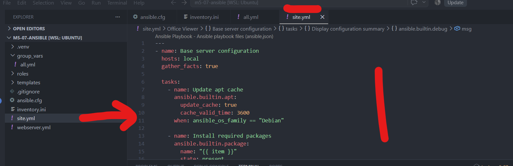

---

## Step 7 — Create the Jinja2 Application Template

The application configuration template was created at:

```text
templates/app.conf.j2
```

It uses Ansible variables and Jinja2 conditionals to generate environment-specific configuration.

Example logic:

```jinja2
max_connections = 1024256

[logging]
level = WARNINGDEBUG
```

For the current development environment, the dry-run generated values such as:

```text
workers = 2
server_name = localhost
max_connections = 256
level = DEBUG
log_file = /opt/bootcamp-app/logs/bootcamp-app.log
```

This verifies that Jinja2 variables and conditionals were rendered correctly.

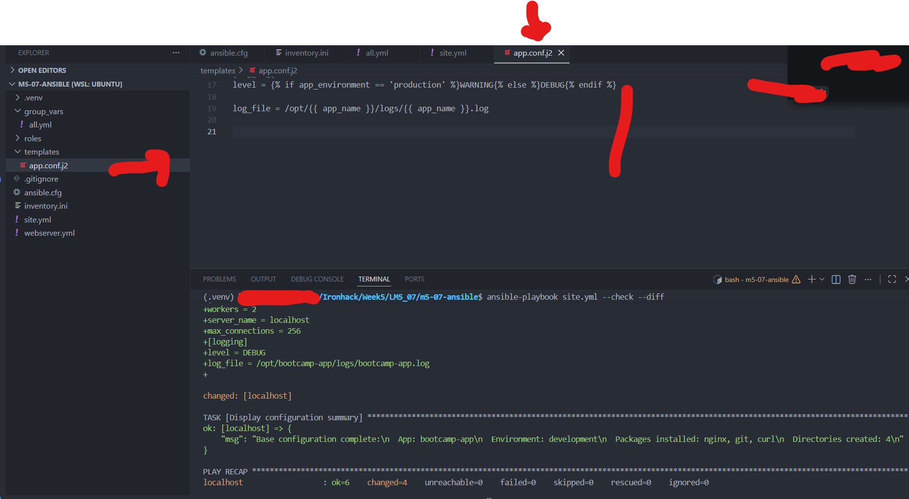

---

## Step 8 — Write the Web Server Playbook

The `webserver.yml` playbook configures nginx for the application.

It:

- Ensures nginx is installed
- Creates the document root
- Deploys a custom HTML page
- Writes an nginx virtual host
- Creates the `sites-enabled` symbolic link
- Reloads nginx when configuration changes

The site enablement task is:

```yaml
- name: Enable site
  ansible.builtin.file:
    src: /etc/nginx/sites-available/{{ app_name }}
    dest: /etc/nginx/sites-enabled/{{ app_name }}
    state: link
    force: true
  notify: Reload nginx
```

The handler avoids service reload during check mode:

```yaml
handlers:
  - name: Reload nginx
    ansible.builtin.service:
      name: nginx
      state: reloaded
    when: not ansible_check_mode
```

The playbook was validated with:

```bash
ansible-playbook webserver.yml --check --diff
```

Result:

```text
failed=0
```

and the nginx handler was skipped during check mode as intended.

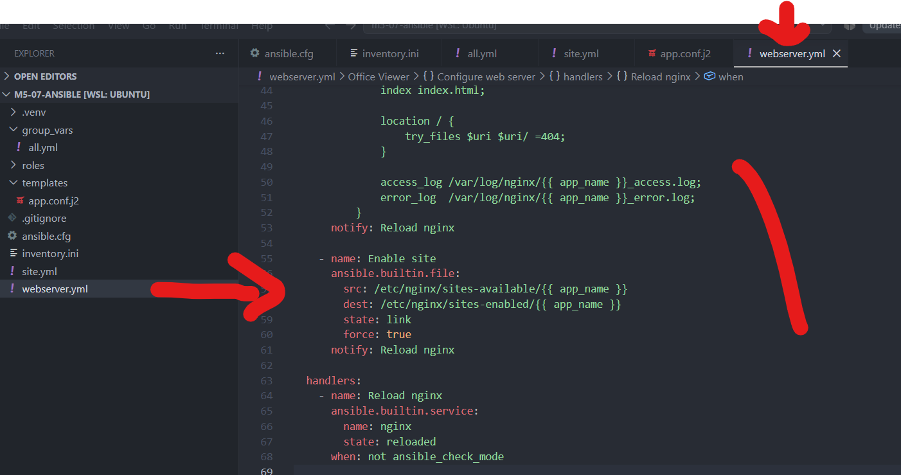

---

## Step 9 — Create the Web Page Template

The reusable role template was created at:

```text
roles/webserver/templates/index.html.j2
```

Template:

```html
<!DOCTYPE html>
<html lang="en">
<head>
  <meta charset="UTF-8">
  <title>{{ app_name }} — {{ app_environment }}</title>
</head>
<body>
  <h1>Welcome to {{ app_name }}</h1>
  <p>Environment: <strong>{{ app_environment }}</strong></p>
  <p>Server: {{ ansible_hostname | default('unknown') }}</p>
  <p>Managed by Ansible</p>
</body>
</html>
```

This page dynamically renders the application name, environment, and server hostname.

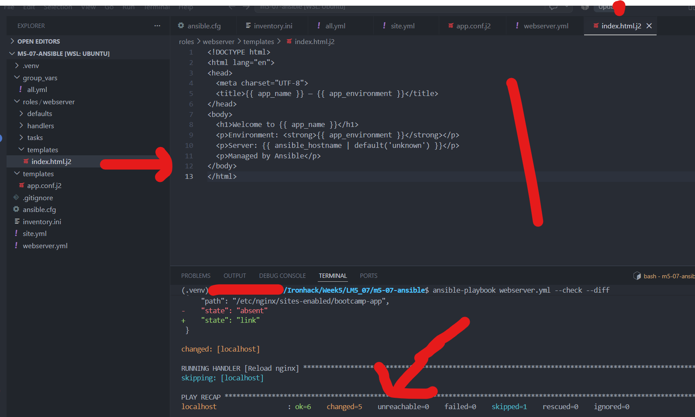

---

## Step 10 — Build a Reusable `webserver` Role

A reusable role was created under:

```text
roles/webserver/
├── defaults/main.yml
├── handlers/main.yml
├── tasks/main.yml
└── templates/index.html.j2
```

The role provides default values such as:

```yaml
---
webserver_port: 80
webserver_document_root: "/var/www/html"
webserver_server_name: "localhost"
webserver_packages:
  - nginx
```

The role is called from `role-webserver.yml`:

```yaml
---
- name: Apply webserver role
  hosts: webservers
  become: true
  roles:
    - role: webserver
      vars:
        webserver_document_root: "/var/www/{{ app_name }}"
        webserver_server_name: "{{ nginx_server_name }}"
```

Validation commands:

```bash
ansible-lint roles/webserver
ansible-playbook role-webserver.yml --syntax-check
```

Validation result:

```text
Passed: 0 failure(s), 0 warning(s)
playbook: role-webserver.yml
```

This confirms that the role passed linting and that the calling playbook has valid Ansible syntax.

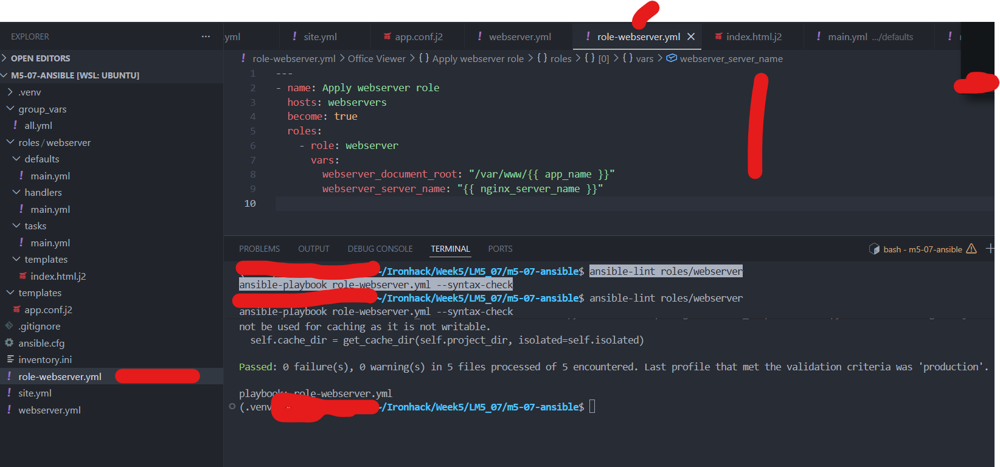

---

## Step 11 — Integrate Ansible with GitHub Actions

A GitHub Actions workflow was created at:

```text
.github/workflows/ansible-ci.yml
```

The workflow performs:

- Repository checkout
- Python setup
- Installation of Ansible and `ansible-lint`
- Lint validation
- Syntax checks for all playbooks
- Check-mode dry-run of `site.yml`

Core validation steps:

```yaml
- name: Run ansible-lint
  run: |
    ansible-lint site.yml webserver.yml role-webserver.yml

- name: Syntax check - site playbook
  run: |
    ansible-playbook site.yml --syntax-check

- name: Syntax check - webserver playbook
  run: |
    ansible-playbook webserver.yml --syntax-check

- name: Syntax check - role playbook
  run: |
    ansible-playbook role-webserver.yml --syntax-check

- name: Dry-run site playbook (check mode)
  run: |
    ansible-playbook site.yml --check --diff
```

The workflow was committed and pushed to GitHub.

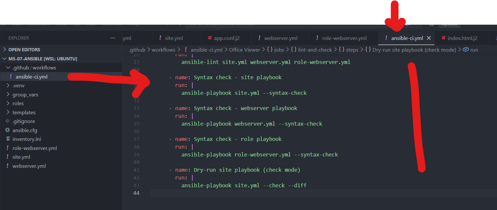

---

## Final CI Validation

The GitHub Actions run completed successfully.

The `lint-and-check` job finished with a green status and the overall workflow showed:

```text
Status: Success
```

This verifies that:

- `ansible-lint` passed
- playbook syntax checks passed
- the check-mode run passed
- the repository meets the core CI requirements of the lab

The Actions page also displayed a Node.js deprecation annotation from a GitHub-hosted action. This was a **non-blocking warning** and did not affect the successful workflow result.

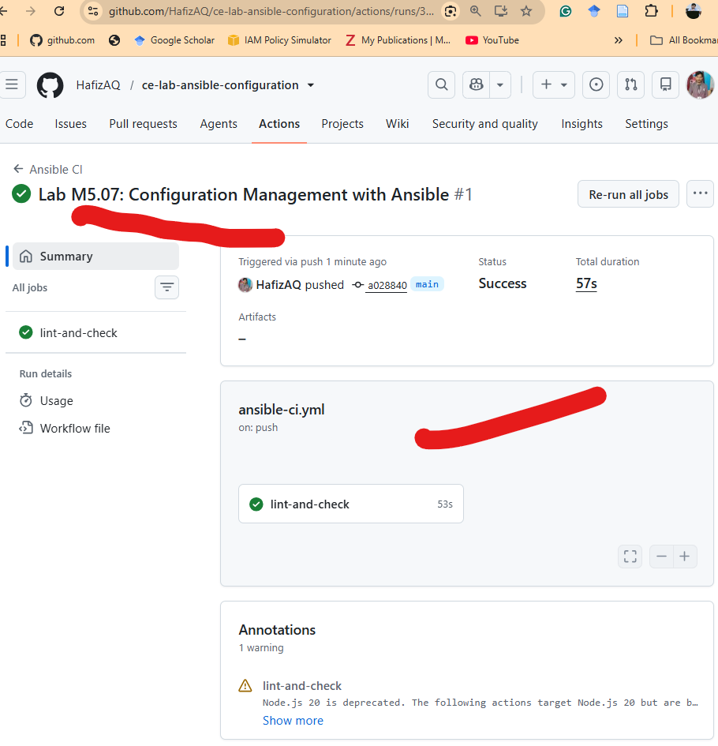

---

## Validation Summary

| Requirement | Result |
|---|---|
| Ansible installed and verified | ✅ Passed |
| Local inventory configured | ✅ Passed |
| `ansible all -m ping` | ✅ Passed |
| Base configuration playbook | ✅ Completed |
| nginx/git/curl configuration | ✅ Completed |
| Application directories | ✅ Completed |
| Jinja2 app configuration | ✅ Completed |
| Web server playbook | ✅ Completed |
| Custom index page | ✅ Completed |
| Reusable `webserver` role | ✅ Completed |
| `ansible-lint` | ✅ Passed |
| Playbook syntax checks | ✅ Passed |
| Check-mode dry run | ✅ Passed |
| GitHub Actions CI | ✅ Success |

---

## Problems Encountered and Resolution

### 1. `pip` initially used Python 2.7

Although the Python 3 virtual environment had been activated, the plain `pip` command initially resolved to an older Python 2.7 installation.

The issue was avoided by installing packages through the active Python interpreter:

```bash
python -m pip install --upgrade pip setuptools wheel
python -m pip install ansible ansible-lint
```

This ensured Ansible was installed using the Python interpreter inside `.venv`.

### 2. `ansible-lint` reported missing newline

The role handler initially produced:

```text
yaml[new-line-at-end-of-file]
roles/webserver/handlers/main.yml
```

A final newline was added to the YAML file and linting was rerun.

Final result:

```text
Passed: 0 failure(s), 0 warning(s)
```

### 3. Check-mode service handling

nginx reload was protected with:

```yaml
when: not ansible_check_mode
```

This prevents an unnecessary service operation during `--check`, making the playbook more reliable in WSL/classroom environments.

---

## Commands Used for Final Validation

```bash
ansible --version
ansible-lint --version

ansible all -m ping

ansible-playbook site.yml --check --diff
ansible-playbook webserver.yml --check --diff

ansible-lint roles/webserver
ansible-playbook role-webserver.yml --syntax-check

git status
git add .
git commit -m "Lab M5.07: Configuration Management with Ansible"
git push
```

---

## Conclusion

Lab M5.07 was completed successfully.

The finished project uses Ansible to manage server configuration in a repeatable and version-controlled way. Variables and Jinja2 templates provide environment-specific configuration, while the reusable `webserver` role demonstrates modular automation. GitHub Actions automatically validates the Ansible code on every push, helping detect lint, syntax, and configuration problems before changes are applied.

**Final Status: ✅ Configuration Management with Ansible successfully implemented.**
